# [Kafka & AVRO Examples](https://github.com/davamigo/kafka-examples-avro)

**GitHub**: [davamigo/kafka-examples-avro](https://github.com/davamigo/kafka-examples-avro)

This project is an example of AVRO schema evolution with full compatibility mode, working in
[Apache Kafka](https://kafka.apache.org/) with the [Confluent Schema Registry](https://docs.confluent.io/current/schema-registry/docs/index.html).

This project has three branches:

- **[v1](https://github.com/davamigo/kafka-examples-avro/tree/v1)** - Publish and subscribe to a Kafka topic using an AVRO contract.
- **[v2](https://github.com/davamigo/kafka-examples-avro/tree/v2)** - Added some fields to the contract (with default values).
- **[v3](https://github.com/davamigo/kafka-examples-avro/tree/v3)** - Removed some fields from the contract (with default values).

## AVRO contracts

### Customer V1

```
{
  "type": "record",
  "namespace": "com.privalia.poc.avrodemo.avro",
  "name": "Customer",
  "fields": [
    {
      "name": "uuid",
      "type": "string",
      "doc": "The unique identifier of the customer"
    },
    {
      "name": "first_name",
      "type": "string",
      "doc": "First name of the customer"
    },
    {
      "name": "last_name",
      "type": "string",
      "doc": "Last name of the customer"
    },
    {
      "name": "age",
      "type": [ "null", "int" ],
      "default": null,
      "doc": "Age at the time of registration"
    },
    {
      "name": "height",
      "type": [ "null", "float" ],
      "default": null,
      "doc": "Height at the time of registration in cm"
    },
    {
      "name": "weight",
      "type": [ "null", "float" ],
      "default": null,
      "doc": "Weight at the time of registration in kg"
    }
  ]
}
```

### Customer V2

```
{
  "type": "record",
  "namespace": "com.privalia.poc.avrodemo.avro",
  "name": "Customer",
  "fields": [
    {
      "name": "uuid",
      "type": "string",
      "doc": "The unique identifier of the customer"
    },
    {
      "name": "first_name",
      "type": "string",
      "doc": "First name of the customer"
    },
    {
      "name": "last_name",
      "type": "string",
      "doc": "Last name of the customer"
    },
    {
      "name": "age",
      "type": [ "null", "int" ],
      "default": null,
      "doc": "Age at the time of registration"
    },
    {
      "name": "height",
      "type": [ "null", "float" ],
      "default": null,
      "doc": "Height at the time of registration in cm"
    },
    {
      "name": "weight",
      "type": [ "null", "float" ],
      "default": null,
      "doc": "Weight at the time of registration in kg"
    },
    {
      "name": "phone",
      "type": [ "null", "string" ],
      "default": null,
      "doc": "Phone number"
    },
    {
      "name": "email",
      "type": [ "null", "string" ],
      "default": null,
      "doc": "Email address"
    }
  ]
}
```

### Customer V3

```
{
  "type": "record",
  "namespace": "com.privalia.poc.avrodemo.avro",
  "name": "Customer",
  "version": "2",
  "fields": [
    {
      "name": "uuid",
      "type": "string",
      "doc": "The unique identifier of the customer"
    },
    {
      "name": "first_name",
      "type": "string",
      "doc": "First name of the customer"
    },
    {
      "name": "last_name",
      "type": "string",
      "doc": "Last name of the customer"
    },
    {
      "name": "age",
      "type": [ "null", "int" ],
      "default": null,
      "doc": "Age at the time of registration"
    },
    {
      "name": "phone",
      "type": [ "null", "string" ],
      "default": null,
      "doc": "Phone number"
    },
    {
      "name": "email",
      "type": [ "null", "string" ],
      "default": null,
      "doc": "Email address"
    }
  ]
}
```

## Development

### Docker

This PoC uses the **[landoop/fast-data-dev](https://hub.docker.com/r/landoop/fast-data-dev)** docker image because it is very complete and easy to use.

This image has a **Zookeeper** (port: `2121`), 
a **Kafka Broker** (port: `9092`), 
the Confluent **Schema Registry** (port: `8081`) to use AVRO, 
the Confluent **REST Proxy** (port: `8082`)
an d a web based *User Interface* (port: `3030`).

#### scripts

* *`docker/startKafka.sh`*

```
docker run --rm -d \
    -p 2181:2181 -p 3030:3030 \
    -p 8081:8081 -p 8082:8082 \
    -p 8083:8083 -p 9092:9092 \
    -e ADV_HOST=127.0.0.1 \
    -e SAMPLEDATA=0 \
    -e RUNTESTS=0 \
    --name docker_kafka_dev \
    landoop/fast-data-dev:2.0
```

* *`docker/stopKafka.sh`*

```
docker stop docker_kafka_dev
```

## Evolving the schema

Run the Kafka container.

```
$ docker/startKafka.sh
```

Checkout `v1` branch and run the project.

```
$ git checkout v1
$ gradle clean
$ gradle build
$ java -jar build/libs/avrodemo-0.0.1-SNAPSHOT.jar
```

Open the browser.
Go to `http://localhost:8080`.
Navigate to **Create Customer** screen or go to `http://localhost:8080/customers/create`.
Create a new customer.

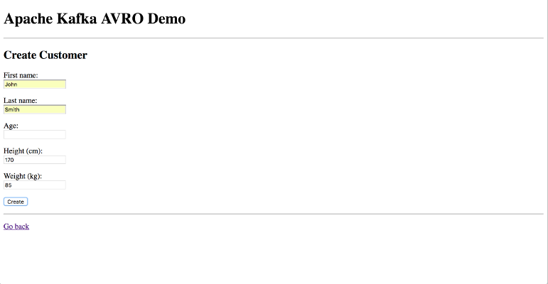

Navigate to the properties of this customer.

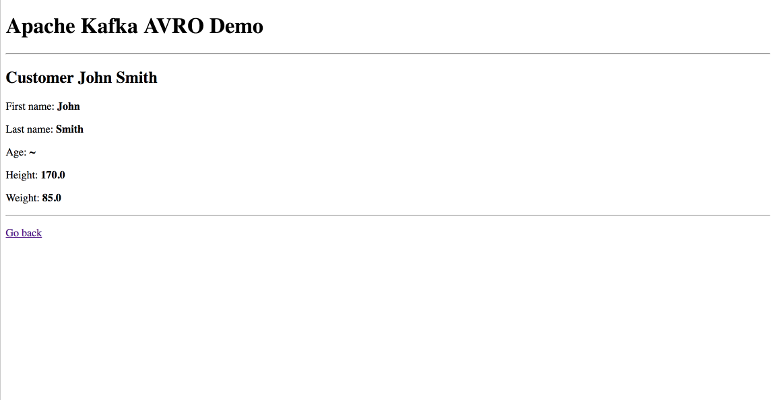

Also you can see the message in the **Kafka UI**.
Open the browser.
Go to `http://localhost:3030/kafka-topics-ui/#/cluster/fast-data-dev/topic/n/customers/`.

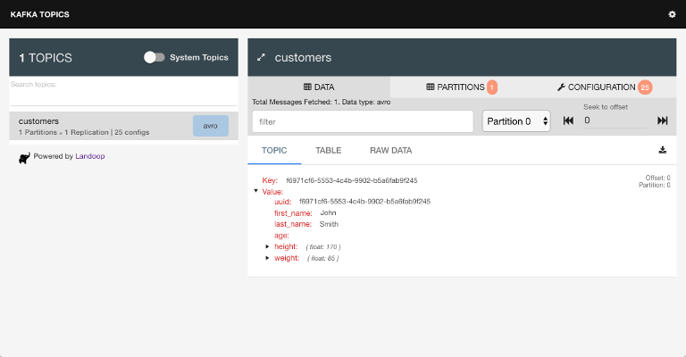

If you go schemas section of the **Kafka UI** at
`http://localhost:3030/schema-registry-ui/#/cluster/fast-data-dev/schema/customers-value/version/1`
you will see two schemas registered: `customers-value` and `customers-key`.
The first one is the contract for the value of the message of the topic `customers`.
The second is for the key.

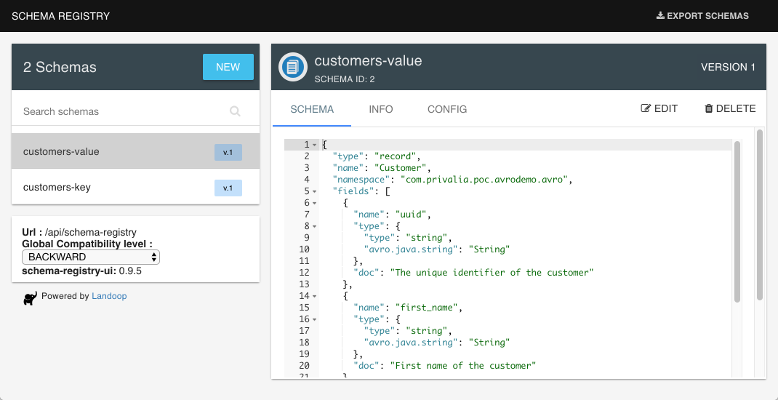

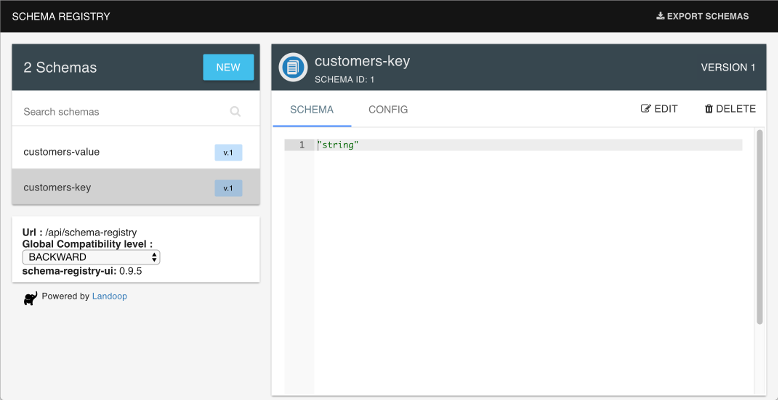

You can try to create other customers.
The only mandatory fields are the `first_name` and the `last_name`.
The `uuid` is also mandatory, but it is set buy the app.

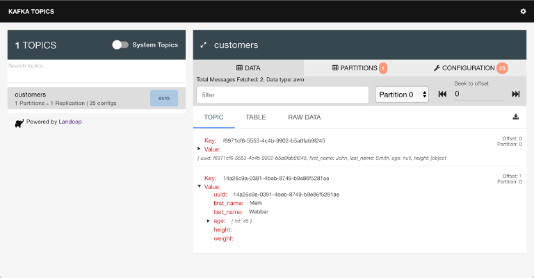

Checkout `v2` branch and run the project.
Do not stop the Kafka container.
It is important to `clean` and `build` again the project.

```
$ git checkout v2
$ gradle clean
$ gradle build
$ java -jar build/libs/avrodemo-0.0.1-SNAPSHOT.jar
```

If you try to create a new customer (`http://localhost:8080/customers/create`)
you will see two new optional fields in the form: `phone` and `email`.

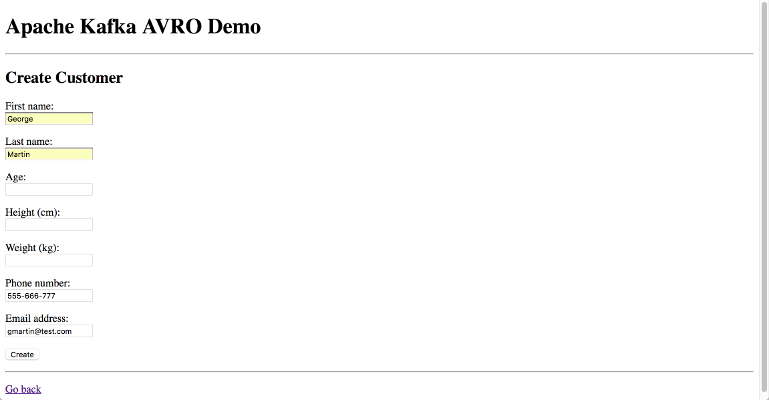

After creating the new customer if you go to the **Kafka UI**, you will see the new message have
the new fields but the old messages don't.

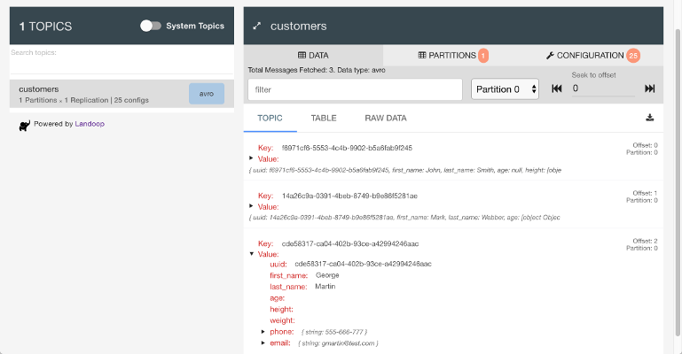

And the old messages can be read with the new version of the contract because is ***full compatible***.
The new fields will have the default value (`null` in this example).

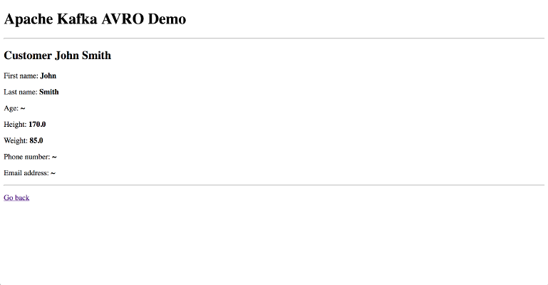

In the Schema Registry now you have a new version of the `customers-value` schema:

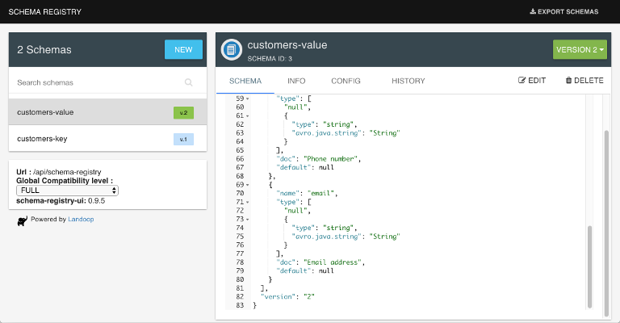

Checkout `v3` branch and run the project.

```
$ git checkout v3
$ gradle clean
$ gradle build
$ java -jar build/libs/avrodemo-0.0.1-SNAPSHOT.jar
```

Create a new customer.
The fields `height` and `weigth` are not in the form anymore, but you can still create the customer.

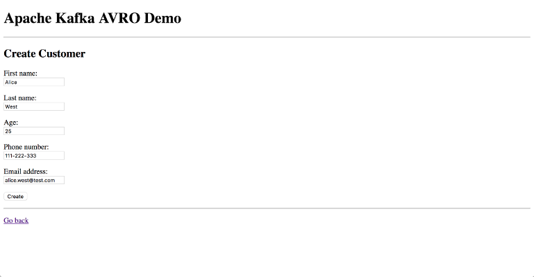

The topic has 4 messages with three different contracts which are fully compaible between each other.
The schema has evolver properly

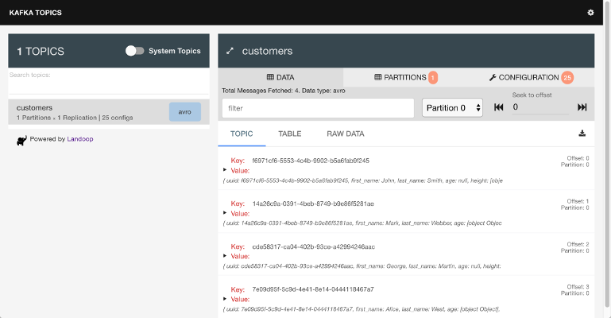
